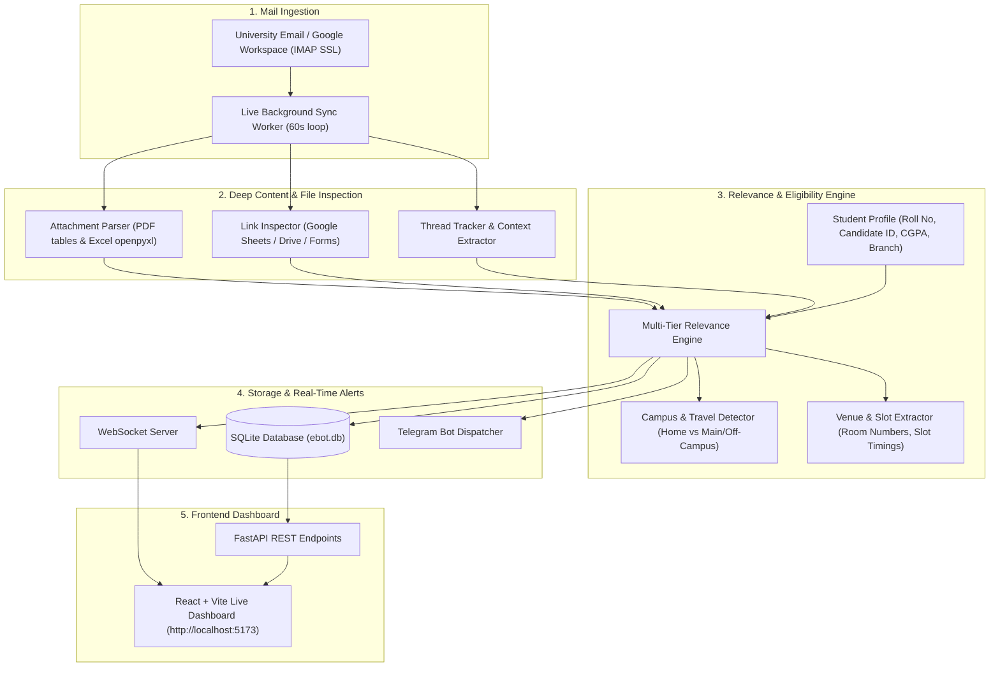

# 🦁 E-Bot: College Placement & Academic Mail Intelligence Engine

[](https://fastapi.tiangolo.com)
[](https://reactjs.org/)
[](https://vitejs.dev/)
[](https://www.sqlite.org/)
[](https://core.telegram.org/bots/api)
[](https://www.python.org/)

> **An automated, real-time college email intelligence engine that silently synchronizes institutional Gmail inboxes, deeply inspects PDF/Excel/Online Google Sheets for student roll numbers and candidate IDs, verifies campus eligibility, extracts test slots & classroom venues, and delivers instant, structured alerts to Telegram.**

---

## 📌 Short Description

**E-Bot** is an autonomous mail processing and notification engine designed for university students navigating high-volume placement drives and academic circulars. Running silently in the background, it connects to your college email via IMAP SSL, parses attachments and linked Google Sheets/Drive files to detect student shortlists, validates academic cutoffs (CGPA, 10th/12th percentages, branch eligibility, campus restrictions), extracts physical classroom venues and test slots, and sends real-time bullet-pointed notifications directly to your Telegram.

---

## 🏛️ System Architecture



---

## ✨ Comprehensive Features

### 1. 📬 Live IMAP Mail Sync (Non-Blocking Backend Loop)
- Connects securely to institutional Google Workspace / IMAP servers via SSL (`imap.gmail.com:993`).
- Polls incoming university emails every 60 seconds completely in the background without refreshing or disturbing the frontend dashboard.
- Maintains idempotency so already processed emails and notifications are never duplicated.

### 2. 🎯 Deep Shortlist & Document Scanner
- **PDF Parsing (`pdfplumber` & `pypdf`):** Automatically extracts tabular data from multi-page PDF candidate lists and scans for Roll Numbers, Candidate IDs, and Names.
- **Excel & Spreadsheet Parsing (`openpyxl` & `csv`):** Iterates through all sheets and rows in attached `.xlsx`, `.xls`, `.csv`, `.tsv` files.
- **Online Google Sheets & Google Drive Live Scanner:** Converts linked public Google Sheets into live CSV export streams (`gviz/tq?tqx=out:csv`) and downloads Google Drive files to identify shortlist matches in real time.
- **URL Redirection Unshortener:** Automatically resolves shortened links (`bit.ly`, `tinyurl.com`, `forms.gle`) to reach the target sheet or document.

### 3. 🏫 Dynamic Campus & Travel Detection
- **Home Campus Awareness:** Configurable for your specific university campus and regional center.
- **Centralized Drive Filtering:** If a centralized placement drive is exclusively for other university campuses (and excludes your home campus), it automatically marks the student as ineligible with an explicit reason.
- **Physical Travel Requirement Detection:** Detects if shortlisted students are required to physically report to a main campus or external testing center for offline rounds, highlighting a dedicated travel alert.

### 4. 📍 Classroom Venue & Test Slot Extractor
- Automatically extracts assigned **Classroom / Lab Venues** (e.g. `Hall 205`, `Lab 104`, `Room 717`, `Campus Lab`).
- Automatically extracts **Slot Timings & Batches** (e.g. `Slot 3 at 12:00 noon`, `Batch 2 at 10:30 AM`, `Batch 1 at 8:30 AM`).

### 5. 🤖 Structured Telegram Alerts (Point-by-Point Format)
Dispatches formatted notifications to your private Telegram chat:
- **🎯 Critical Shortlist Alert:** Triggered immediately when your Roll No, Candidate ID, or Name is found in any body text, PDF, Excel attachment, or online Google Sheet.
- **🏛️ Department / Academic Notice:** Instant high-priority dispatch with notice key points.
- **📢 Placement Office Updates:** Immediate alerts for company benchmarking exams, slot updates, attendance/biometrics, and cancellations.
- **✅ Eligible Placement Drive:** Evaluates student CGPA, 10th/12th percentages, graduation batch, and branch criteria.
- **❌ Ineligible Placement Drive:** Notifies you with the exact reason why you are ineligible (e.g., Core branches only, CGPA cutoff, or degree mismatch).
- **ℹ️ Not Shortlisted Notice:** Alerts you when a candidate list was published for a company you applied for, but your ID was not in the list.

### 6. 💻 Interactive Web Dashboard
- Modern, clean, responsive UI built with React, Vite, and Lucide icons.
- **Live WebSocket Alert Feed:** Real-time push updates with status badges (`SHORTLIST MATCH`, `ELIGIBLE DRIVE`, `NOT SHORTLISTED`, `INELIGIBLE FOR DRIVE`, `UPDATE`).
- **Applied Companies Tracker:** Add and manage target companies with applied dates and round statuses.
- **Attachment Viewer & Extractor:** Inspect extracted text and match snippets from attached files.
- **Student Profile Modal:** View and update active academic parameters on the fly.

---

## 🛠️ Technology Stack

| Layer | Technology | Description |
| :--- | :--- | :--- |
| **Backend Framework** | FastAPI (Python 3.10+) | High-performance async REST API & WebSocket server |
| **Email Protocol** | IMAP SSL (`imaplib` / `email`) | Secure mail sync with Gmail & Google Workspace |
| **Document Parsing** | `pdfplumber`, `pypdf`, `openpyxl`, `bs4` | Extraction of PDF tables, Excel sheets, HTML anchors |
| **Database** | SQLite + SQLAlchemy ORM | Lightweight, persistent local database (`ebot.db`) |
| **Notifications** | Telegram Bot API (`requests`) | Direct mobile push alerts with HTML markdown |
| **Frontend Framework** | React 18 + Vite | Blazing fast client with custom styling |
| **Real-time Sync** | WebSockets (`ws://`) | Instant client updates upon email processing |

---

## 📂 Repository Structure

```
E-Bot/
├── backend/
│   ├── app/
│   │   ├── api/
│   │   │   └── routes.py              # REST API endpoints & WebSocket handlers
│   │   ├── core/
│   │   │   └── config.py              # Environment configuration & settings
│   │   ├── db/
│   │   │   ├── database.py            # SQLite session & engine setup
│   │   │   └── models.py              # SQLAlchemy database models
│   │   ├── services/
│   │   │   ├── attachment_parser.py   # Multi-page PDF, Excel, and CSV parser
│   │   │   ├── gmail_client.py        # IMAP SSL client & email extractor
│   │   │   ├── link_inspector.py      # Google Sheets, Drive & shortlink scanner
│   │   │   ├── live_mail_sync.py      # Background sync loop worker
│   │   │   ├── notifier.py            # Telegram alert dispatcher
│   │   │   ├── relevance_engine.py    # 6-tier classification & campus engine
│   │   │   └── thread_tracker.py      # Email thread history & trail tracker
│   │   └── main.py                    # FastAPI application initialization
│   ├── scripts/
│   │   └── re_evaluate.py             # Offline database re-evaluation utility
│   ├── .env.example                   # Environment variable template
│   └── requirements.txt               # Backend dependencies
├── frontend/
│   ├── src/
│   │   ├── components/
│   │   │   ├── AlertFeed.jsx          # Live notification feed component
│   │   │   ├── AppliedCompanies.jsx   # Company application tracking widget
│   │   │   ├── AttachmentScanner.jsx  # Attachment preview & match scanner
│   │   │   ├── Navbar.jsx             # Top navigation bar
│   │   │   └── ProfileModal.jsx       # Student profile editor modal
│   │   ├── context/
│   │   │   └── NotificationContext.jsx # Global WebSocket state management
│   │   ├── utils/
│   │   │   └── audioAlerts.js         # Sound alert synthesizer
│   │   ├── App.jsx                    # Main application component
│   │   ├── App.css & index.css        # Clean UI styling & layout
│   │   └── main.jsx                   # React DOM entry point
│   ├── package.json                   # Frontend dependencies
│   └── vite.config.js                 # Vite build configuration
├── .gitignore                         # Security rules protecting secrets & DB
└── README.md                          # Comprehensive documentation
```

---

## 🚀 Step-by-Step Setup Guide

### 1. Prerequisites
- Python 3.10 or higher installed
- Node.js 18+ and npm installed
- A Gmail/Google Workspace account with an **App Password** generated ([Google App Passwords](https://myaccount.google.com/apppasswords))
- A Telegram Bot Token from [@BotFather](https://t.me/BotFather) and your Chat ID from [@userinfobot](https://t.me/userinfobot)

---

### 2. Backend Installation

```bash
# Navigate to the backend directory
cd backend

# Create a virtual environment
python -m venv venv

# Activate virtual environment
# Windows (PowerShell / Command Prompt):
venv\Scripts\activate
# macOS / Linux:
source venv/bin/activate

# Install dependencies
pip install -r requirements.txt
```

---

### 3. Environment Configuration

Create a `.env` file inside the `backend/` directory based on `.env.example`:

```bash
cp .env.example .env
```

Edit `backend/.env` with your actual credentials:

```ini
# University Gmail / Google Workspace IMAP Credentials
COLLEGE_EMAIL=your_email@university.edu
GMAIL_APP_PASSWORD=your_16_digit_app_password
IMAP_SERVER=imap.gmail.com
IMAP_PORT=993
SYNC_INTERVAL_SECONDS=60
FETCH_LIMIT=30

# Student Target Profile & Academic Thresholds
STUDENT_NAME=Your Full Name
STUDENT_ROLL=YOUR_ROLL_NUMBER
STUDENT_NEOPAT=YOUR_CANDIDATE_ID
STUDENT_DEGREE=B.Tech
STUDENT_BRANCH=Computer Science & Engineering
STUDENT_BATCH=2027
STUDENT_10TH=80.0
STUDENT_12TH=80.0
STUDENT_CGPA=8.00
STUDENT_STANDING_ARREARS=0

# Mobile Push Notifications (Telegram)
TELEGRAM_BOT_TOKEN=your_telegram_bot_token_here
TELEGRAM_CHAT_ID=your_telegram_chat_id_here

# Server Configuration
DATABASE_URL=sqlite:///./ebot.db
PORT=8000
```

---

### 4. Frontend Installation

```bash
# Navigate to the frontend directory
cd ../frontend

# Install node dependencies
npm install
```

---

### 5. Running the Application

**Start the Backend Server (Terminal 1):**
```bash
cd backend
python -m uvicorn app.main:app --host 127.0.0.1 --port 8000
```

**Start the Frontend Web Dashboard (Terminal 2):**
```bash
cd frontend
npm run dev
```

Open your browser at **`http://localhost:5173`** to view the live dashboard.

---

## 📱 Telegram Alert Examples

### 🎯 Shortlist Alert (with Travel Notice)
```text
🎯 CRITICAL ALERT: YOU HAVE BEEN SHORTLISTED!

• 🏢 Company: Example Global Corp
• 📅 Date: 28th October 2026
• ⏰ Time: 9:00 AM
• 🏫 Campus: ⚠️ Main Campus (Travel Required)
• 🚆 Travel Notice: ⚠️ In-Person / Physical reporting required at Main Campus!
• 📍 Found In: Candidate ID in Attached Shortlist Sheet
• 📝 Subject: Shortlist for Campus Drive: Technical Interview Round
• 👤 Student: Student Name (YOUR_ROLL_NUMBER)
```

### 📢 Placement Office / CDC Update (Exam & Slot Allocation)
```text
📢 PLACEMENT OFFICE UPDATE

• 🏛️ From: Placement Office / Academic Coordinator
• 📅 Date: 24th October 2026
• ⏰ Time: 11:44 AM
• 🏫 Campus: Home Campus (Local / Virtual)
• 📍 Classroom / Lab: Lab 104, Room 205
• ⏰ Slot Timings: Slot 3 at 12:00 noon, Batch 2 at 10:30 AM
• 📝 Subject: Placement Assessment Slot Allocation
• 💬 Latest Instructions:
  • Assessment rescheduled for registered students.
  • Reporting venue for morning slots is Room 205.
```

### ✅ Eligible Campus Drive Notification
```text
✅ ELIGIBLE PLACEMENT DRIVE!

• 🏢 Company: Global Innovations Ltd
• 📅 Drive Date: 25th October 2026
• ⏰ Time: 8:00 PM
• 🏫 Campus: Home Campus
• ⏳ Registration Deadline: 25th October 2026, 12:00 PM
• 📊 Eligibility Summary:
  - CGPA: Meets Cutoff (Eligible)
  - Academics: 10th & 12th Met
  - Branch: CSE / Circuital Branches Eligible
• 📝 Subject: Campus Recruitment Drive Registration Open
```

---

## 🔒 Security & Privacy

- **No Plaintext Passwords Committed:** Credentials, app passwords, and bot tokens are stored strictly inside `.env` files which are excluded from version control via `.gitignore`.
- **Database Safety:** SQLite database files (`*.db`) and downloaded attachments are ignored.
- **Institutional Signature Sanitization:** Footers and recipient headers are sanitized during evaluation to prevent false identity matches.

---

## 📄 License

This project is licensed under the MIT License — feel free to fork, adapt, and build upon it!
